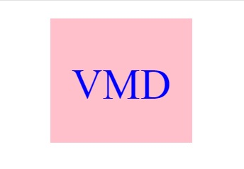

# SVG-logo-maker

## Description
This command-line application takes in user input (color and text for the logo, as well as the shape desired and the color for your shape) to generate a logo and save it as an SVG file. 

### User-Story
AS a freelance web developer

I WANT to generate a simple logo for my projects

SO THAT I don't have to pay a graphic designer

### Acceptance-Criteria
GIVEN a command-line application that accepts user input

WHEN I am prompted for text

THEN I can enter up to three characters

WHEN I am prompted for the text color

THEN I can enter a color keyword (OR a hexadecimal number)

WHEN I am prompted for a shape

THEN I am presented with a list of shapes to choose from: circle, triangle, and square

WHEN I am prompted for the shape's color

THEN I can enter a color keyword (OR a hexadecimal number)

WHEN I have entered input for all the prompts

THEN an SVG file is created named `logo.svg`

AND the output text "Generated logo.svg" is printed in the command line

WHEN I open the `logo.svg` file in a browser

THEN I am shown a 300x200 pixel image that matches the criteria I entered

### Mock-Up

Walkthrough: https://drive.google.com/file/d/1MQNn3KrV9oFHfq0EPDzZHeuH3-ElYNQQ/view

The following screenshot is an example of the image created using the following input:

logo text = VMD

logo text color = blue

shape color = pink

shape = square

## Installation-Execution

Open a command terminal, go to the SVG-logo-maker folder and execute index.js using the command "node index.js".

You will be prompted to enter the following information:

1. Logo text of up to 3 digits

2. Color of the logo text using color keyword or a '#' started hexadecimal number representing a color

3. Shape - choose from Circle, Triangle and Square

4. Color of the shape that the text will be on

## Usage

The SVG Logo Maker can be used to create simple logos (300 x 200) of format SVG. The logo will be stored in an examples folder named logo.svg. You may change the name or move it to prevent it from being overwritten when the next logo is created.

## Testing
The SVG Logo Maker was tested using "jest". To run the tests, go to the SVG-logo-maker folder and execute "npm run test". You will need to install npm and/or jest if not already installed.

## Credits
N/A

## License
N/A